# wheel_leg_analysis

这是对
[`Skythinker616/foc-wheel-legged-robot`](https://github.com/Skythinker616/foc-wheel-legged-robot)
五连杆腿部数学模型的独立 Python 复现与机械特性分析。参考版本固定为上游
提交 `e2444395dd3a76c20b0683fbb1e123c21186a502`。工程目前包含第一阶段的
数学/C 对照验证、第二阶段的原结构全局工作空间分析、第三阶段的正常
装配模式连续伸缩研究，以及正在进行的真实机械包络验证；不涉及杆长优化、
执行器动力学、MuJoCo、强化学习或 ROS。

## 验证结论

验证通过。Python 与原 MATLAB 公式、MATLAB Coder 生成的三个单精度 C
函数在合法且远离闭环奇异边界的 406 组测试数据上数值一致。所有 C/Python
输出均为有限值，没有超过回归阈值的失败点。

Python 使用 `float64`，原 C 接口使用 `float32`。所有角度、速度、力和力矩
输入先量化为同一个 `float32` 值，再分别交给 Python 和 C，以下是实际绝对
误差，不是仅判断“能否运行”。

| 输出 | 单位 | 最大绝对误差 | 平均绝对误差 | 测试阈值 |
|---|---:|---:|---:|---:|
| `l0` | m | 1.5483113736e-07 | 6.6593644333e-09 | 2.0e-07 |
| `phi0` | rad | 4.2891631316e-06 | 1.1455068755e-07 | 5.0e-06 |
| `dL` | m/s | 8.7192901828e-05 | 2.6978911863e-07 | 1.0e-04 |
| `dPhi` | rad/s | 2.2216659435e-03 | 6.8067460022e-06 | 3.0e-03 |
| `T1` | N m | 2.3053082900e-03 | 8.2771319044e-06 | 3.0e-03 |
| `T2` | N m | 1.2903793645e-03 | 4.7409576230e-06 | 2.0e-03 |

“明显差异”采用比通过阈值更严格的观察阈值，用于暴露单精度敏感点，不代表
测试失败。共记录 4 点：

| # | `(phi1, phi4)` rad | `(dphi1, dphi4)` rad/s | `(F, Tp)` | 超过观察阈值的误差 |
|---:|---|---|---|---|
| 3 | `(1.086452961, -3.035454750)` | `(0.350000, -0.150000)` | `(33.000000, 0.100000)` | `l0=1.548e-07`, `phi0=4.289e-06`, `dPhi=1.159e-04`, `T1=9.085e-04`, `T2=5.079e-04` |
| 122 | `(1.272320986, 3.083838940)` | `(1.833285, 4.116742)` | `(23.170074, -1.942834)` | `phi0=1.003e-06` |
| 186 | `(1.086452961, -3.035454750)` | `(-2.602058, -4.616449)` | `(-66.085556, -0.948967)` | `l0=1.548e-07`, `phi0=4.289e-06`, `dL=8.719e-05`, `dPhi=2.222e-03`, `T1=2.305e-03`, `T2=1.290e-03` |
| 304 | `(0.549493432, -2.319670439)` | `(7.335450, 0.732832)` | `(-71.891205, -1.160547)` | `dPhi=1.328e-04` |

最差姿态的闭环判别式仍为正，属于数学合法位形；但 MATLAB 半角公式中的
`A0 + C0 = -1.061958e-04` 接近零，导致原 `float32` C 展开式发生明显消减
误差。该点没有被删除。分别从原 C `leg_spd` 和 `leg_conv` 反推 Jacobian，
两者在此点自身最大相差 `2.1624565e-04`，说明差异来自原来分别生成的
单精度表达式，而不是 Python 改换了坐标系或装配分支。

## 数学约定

固定主动关节为 `A=(0,0)`、`E=(l5,0)`，角度从 x 轴正方向逆时针增加，单位
为弧度。`phi1` 驱动 A-B，`phi4` 驱动 E-D。实机调用时后关节传入 `phi1`，
前关节传入 `phi4`，本项目保持这个顺序。

```text
B = A + l1 [cos(phi1), sin(phi1)]
D = E + l4 [cos(phi4), sin(phi4)]
O = (l5/2, 0)
l0 = |C - O|
phi0 = atan2(yc, xc-l5/2)
```

C 点严格使用 `matlab/leg_func_calc.m` 的正平方根分支：

```text
phi2 = 2*atan((B0 + sqrt(A0^2+B0^2-C0^2))/(A0+C0))
```

`src/kinematics.py` 用 SymPy 建立上述 `l0`、`phi0` 表达式，并用 `diff`
得到正式的 2x2 Jacobian：

```text
J = d(l0, phi0) / d(phi1, phi4)
[dL, dPhi] = J @ [dphi1, dphi4]
[T1, T2] = J.T @ [F, Tp]
```

有限差分 Jacobian 只用于测试解析结果，不参与速度或力矩计算。虚功等式也在
测试中验证：`[T1,T2] dot dq = [F,Tp] dot [dL,dPhi]`。

## 已验证函数

- `src.kinematics.forward_kinematics`: `xc`、`yc`、`l0`、`phi0`；其中
  `l0/phi0` 对照原 C `leg_pos`，C 点另外通过四根杆长闭环检查。
- `src.kinematics.analytic_jacobian`: SymPy 解析求导，并对照中心有限差分。
- `src.vmc.leg_velocity`: 对照原 C `leg_spd`。
- `src.vmc.joint_torques`: 对照原 C `leg_conv`。
- 原 C `leg_spd` 与 `leg_conv` 反推的两个 Jacobian 也进行了相互检查。

## 安装与运行

需要 Python 3.10+ 和 GCC。Ubuntu/KDE 环境可执行：

```bash
cd /home/fool/robot/wheel_leg_analysis
python3 -m venv .venv
. .venv/bin/activate
python3 -m pip install -r requirements.txt
```

运行全部测试：

```bash
python3 -m pytest -v
```

重新编译原 C 并输出完整误差统计：

```bash
python3 scripts/validate_against_original.py
```

显示五连杆，或保存自定义角度图片：

```bash
python3 scripts/visualize_leg.py --phi1 -2.2 --phi4 -0.9
python3 scripts/visualize_leg.py --phi1 -2.2 --phi4 -0.9 \
  --output artifacts/five_bar_example.png
```

在 Python 中调用：

```python
from src.kinematics import analytic_jacobian, forward_kinematics
from src.vmc import joint_torques, leg_velocity

pose = forward_kinematics(phi1=-2.2, phi4=-0.9)
jacobian = analytic_jacobian(phi1=-2.2, phi4=-0.9)
speed = leg_velocity(-2.2, -0.9, dphi1=1.0, dphi4=-0.5)
torque = joint_torques(force=20.0, virtual_torque=0.3, phi1=-2.2, phi4=-0.9)
```

## 五连杆可视化

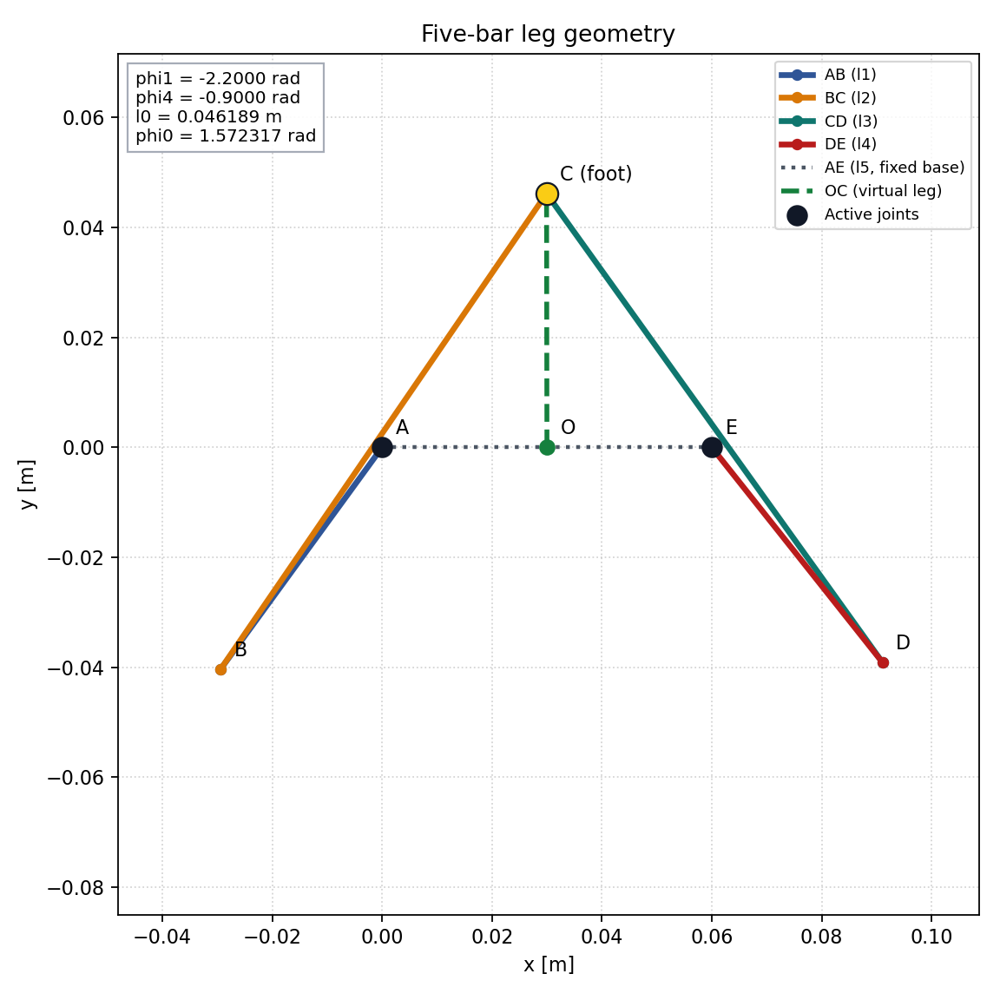

图中 A、E 是两个主动关节，A-B、B-C、C-D、D-E 是四根运动连杆，C 是
足端，O 是固定关节中点，绿色虚线 O-C 是虚拟腿。

## 分支、奇异点与机械限制

- 只复现原 MATLAB 的正平方根装配分支；另一闭环解不是本阶段模型的一部分。
- 闭环判别式小于零时没有实数构型；等于零时两圆相切，Jacobian 会趋于
  奇异。当前 API 与原 C 一样不做机械限位或自动换分支。
- `2*atan` 的半角参数化在 `A0+C0=0` 附近数值敏感，即使几何本身仍合法；
  这是最差误差点的来源。
- `phi0=atan2(...)` 位于 `[-pi, pi]`，跨越分支切线时数值会跳变 `2*pi`；
  该切线上不能直接把角度差当连续速度。
- `l0=0` 时 `phi0` 无定义，相关 Jacobian 也无定义。
- 上游实机代码未给出 `phi1/phi4` 的硬机械限位。它对 `l0>0.12 m` 使用软
  保护，并对虚拟腿相对机身角及机身俯仰使用约 `+/-pi/4` 保护；这些控制层
  约束不等同于五连杆数学可达域。

## 第二阶段：原结构工作空间与传递能力

### 扫描与判据

`phi1`、`phi4` 均在 `[-pi, pi)` 上以 1 度间隔扫描，共 `360 x 360 =
129600` 个姿态。全部采样点都有闭环实数解；这里的“合法”只表示数学闭环
成立，不表示通过了未知的硬关节限位、杆件碰撞、轴承干涉或机身碰撞检查。

扫描仍取原 MATLAB 的正平方根装配分支，但用等价的两圆交点公式稳定计算 C
点。Jacobian 通过两条定长杆约束微分得到，并在常规姿态与第一阶段 SymPy
Jacobian 交叉验证。

原始 `J=d(l0,phi0)/d(phi1,phi4)` 的两行分别具有 m/rad 和 rad/rad 单位，
直接对它做 SVD 会使 condition number 随 m/mm 单位选择改变。因此 CSV
保留了用户要求的原始 `J` 指标，同时主分析采用物理齐次形式：

```text
J_phys = diag(1, l0) @ J
[dL, l0*dPhi] = J_phys @ [dphi1, dphi4]
```

`J_phys` 两行都是足端线速度，`sigma_min` 单位为 m/rad，2-范数 condition
number 无量纲，且在 `l0>0` 时与原 `J` 的秩亏位置完全相同。

| 指标 | 最小值 | 中位数 | 95 分位 | 最大值 |
|---|---:|---:|---:|---:|
| `l0` | 46.098 mm | 95.586 mm | 141.321 mm | 152.069 mm |
| `J_phys sigma_min` | 1.437e-07 m/rad | 2.266e-02 m/rad | 4.006e-02 m/rad | 4.786e-02 m/rad |
| `J_phys condition` | 1.003 | 3.712 | 30.282 | 3.212e+05 |
| 原始 `J sigma_min` | 1.692e-07 | 2.413e-02 | 4.195e-02 | 4.786e-02 |
| 原始 `J condition` | 10.238 | 34.134 | 310.297 | 4.294e+06 |

原始 `J` 行的数值仅用于复算，不用于机械优劣判断。

### XY 工作空间和虚拟腿姿态

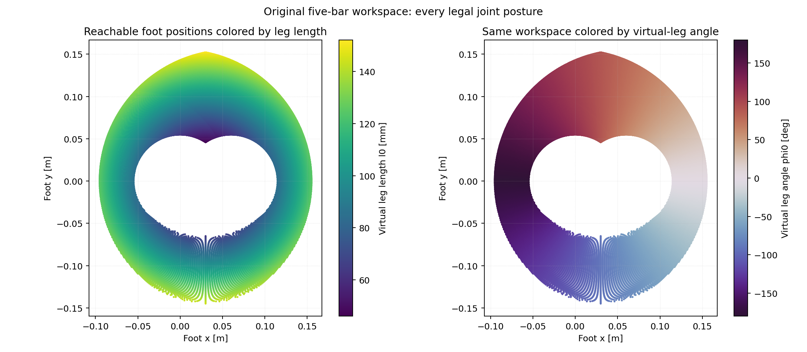

数学 XY 工作空间范围为 `x=-95.00...155.00 mm`、
`y=-144.93...152.07 mm`，虚拟腿长范围为 `46.10...152.07 mm`。中心空洞
表示当前正根装配分支无法把足端收进该区域，并非扫描遗漏。右图说明 `phi0`
完全由 O-C 方向决定，`atan2` 在负 x 轴附近仍存在 `-pi/pi` 色彩跳变。

对机器人实际意味着：机构具备很大的数学覆盖范围，但下半区、横向区域和
极端收腿姿态不等于可用于平衡。加入机身、轮子、杆件碰撞和电机硬限位后，
实际工作空间只会缩小，不能直接用这张图宣称整块区域都可安全运动。

### Jacobian 奇异性

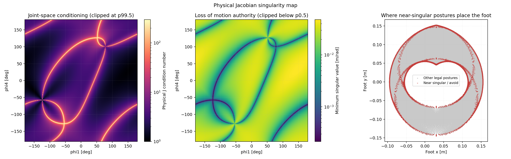

奇异/病态姿态在关节空间形成连续曲线，并不只位于工作空间最外边界。最差
离散样本是 `phi1=-75 deg, phi4=-72 deg`，此时 `l0=53.90 mm`、
`phi0=76.04 deg`、`sigma_min=1.437e-07 m/rad`、condition 约
`3.21e5`。红色 XY 点显示同一个足端位置可能由不同关节姿态到达，其中某些
姿态病态，因此仅依据足端 XY 或腿长不能判断安全性。

对机器人实际意味着：接近深色 `sigma_min` 曲线时，会失去至少一个方向的
足端运动/受力控制能力，模型误差、关节间隙、编码器噪声和扭矩误差都会被
放大。图中既包含输入杆与连杆趋于共线的串联奇异，也包含 B、D 圆心接近
重合的闭环约束病态；控制器应同时监控 `sigma_min` 或 condition，而不是只
设置最大腿长保护。

### 竖直主工作带

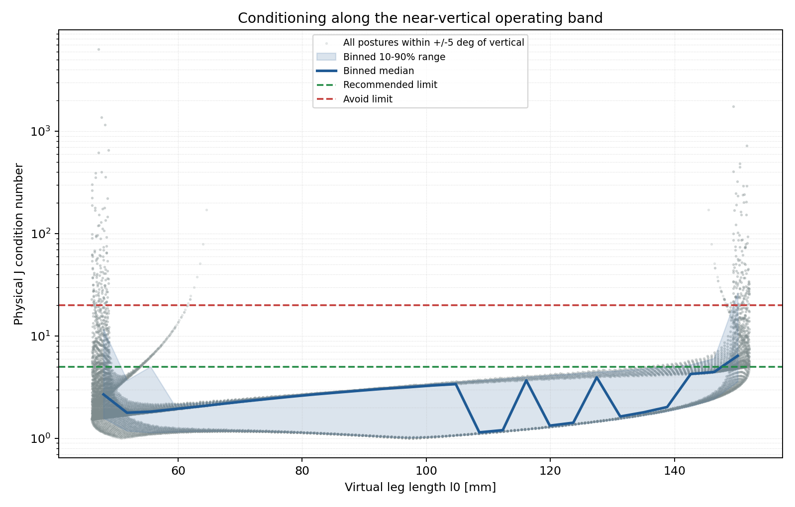

该图只选取 `|phi0-90 deg|<=5 deg` 的 15589 个姿态。灰点保留同一腿长下
不同内部构型的离散性，蓝线是腿长分箱中位数，阴影是 10–90% 范围。

| `l0` | 样本数 | condition 中位数 | condition 90 分位 | 推荐比例 |
|---|---:|---:|---:|---:|
| 45–60 mm | 7166 | 2.067 | 7.535 | 35.96% |
| 60–80 mm | 1827 | 2.091 | 2.538 | 98.91% |
| 80–100 mm | 1127 | 2.727 | 3.205 | 100.00% |
| 100–120 mm | 1032 | 3.316 | 3.865 | 100.00% |
| 120–140 mm | 1335 | 1.950 | 4.619 | 97.60% |
| 140–153 mm | 3102 | 5.041 | 18.850 | 43.13% |

对机器人实际意味着：对接近平衡竖直的腿，`60–140 mm` 是明显更稳定的
运动学区间，尤其 `80–120 mm` 在本次 1 度扫描中全部满足推荐判据；短于
`60 mm` 或长于 `140 mm` 后，不同内部构型间差异急剧增大。原实机约
`70 mm` 目标腿长位于良好区间，`120 mm` 软伸长保护也恰好处于良好区间
外缘，但这只是运动学上的吻合，不是新的结构限位结论。

### 轴向力和伸缩速度传递

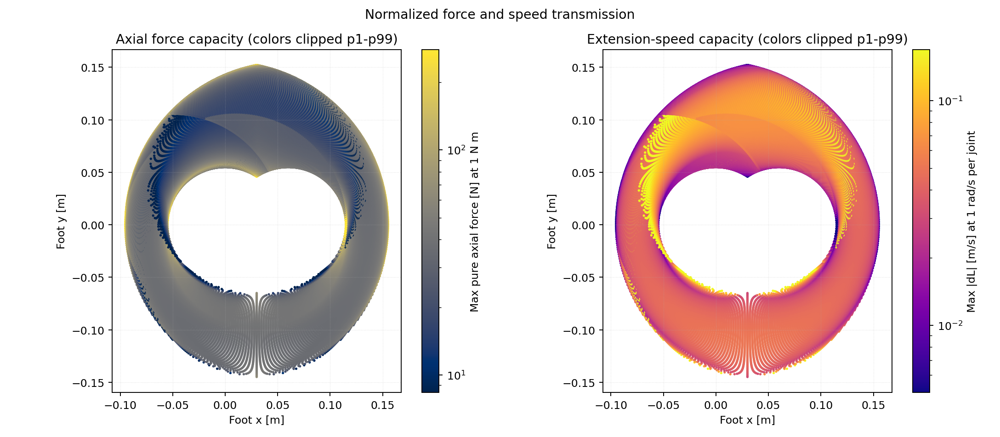

纯轴向力按 `Tp=0`、两个关节各 `|Ti|<=1 N m` 计算：

```text
Fmax = 1 / max(|J11|, |J12|)
```

最大伸缩速度按两个关节各 `|dphii|<=1 rad/s`，允许腿角同时变化：

```text
max |dL| = |J11| + |J12|
```

这两张传递图使用 `phi1/phi4` 关节空间，而不是 XY：同一个 XY 可能对应多个
内部构型及不同传动比，直接在 XY 上覆盖着色会让颜色依赖扫描绘制顺序。

推荐区内，归一化轴向力范围为 `13.07...138.23 N`，中位数 `34.71 N`；
归一化最大伸缩速度范围为 `0.0138...0.0987 m/s`，中位数 `0.0446 m/s`。
实际相同电机的结果可分别按扭矩上限和速度上限线性缩放。

对机器人实际意味着：力和速度存在典型机械传动权衡。全局最大理论轴向力
达到 `7.47e4 N`，但同一姿态最大伸缩速度只有 `1.75e-05 m/s`；全局最大
伸缩速度 `2.894 m/s` 的姿态仅能产生约 `0.615 N` 轴向力。这些夸张数字
来自奇异放大，伴随极低控制裕度，不是可用性能。跳跃与落地分析应只在良好
condition 区域内比较力和速度，且最终还要加入电机峰值/连续扭矩及功率限制。

### 综合工作区分级

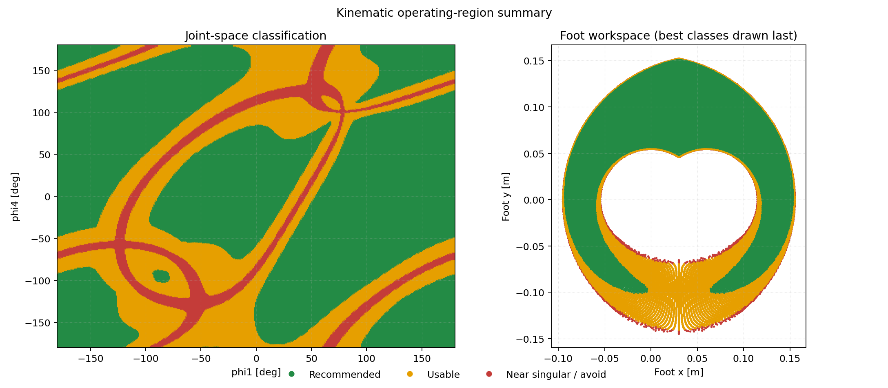

三级判据是：

- 推荐：`condition<=5` 且 `sigma_min>=0.010 m/rad`；
- 可用：`condition<20` 且 `sigma_min>=0.002 m/rad`；
- 接近奇异/不建议：其余合法姿态。

全关节空间中推荐 78188 点（60.33%）、可用 40277 点（31.08%）、不建议
11135 点（8.59%）。竖直带中对应为 9184、4938、1467 点，即推荐
58.91%、可用 31.68%、不建议 9.41%。右侧 XY 图将工作空间划分为
`120 x 120` 栅格，并对落入同一格的全部内部姿态取最佳类别，因此表示该
足端小区域是否至少存在良好内部构型；左侧关节空间图才是选择具体
`phi1/phi4` 时应使用的风险图。右图白格表示离散的 1 度关节扫描没有样本
落入该 XY 小格，不应解释成新的连续不可达边界。

对机器人实际意味着：绿色不是机械安全认证，而是数值传递品质良好；橙色
可以运动但控制裕度下降；红色应避开或降速、限力。真实推荐区必须在此基础
上与关节硬限位、碰撞、自锁/回差、轴承载荷和电机热限制取交集。

### 数据与复现

每个姿态的 `phi1`、`phi4`、`xc`、`yc`、`l0`、`phi0`、原始/物理
Jacobian SVD、condition、`J11...J22`、归一化力/速度和分类码保存在：

- `artifacts/phase2/workspace_scan.csv.gz`
- `artifacts/phase2/summary.json`

重新生成全部第二阶段结果：

```bash
python3 scripts/analyze_workspace.py --resolution 360
```

降低 `--resolution` 可快速预览，但 README 数字均来自 `360 x 360` 正式扫描。

### Phase 2 结论的适用边界

Phase 2 的全局图仍然有效，但其中“竖直主工作带”的样本不是一条机械连续
轨迹：同一个竖直足端位置最多存在四种内部构型，而上游正根正运动学在
`l0=70 mm` 时会把其中三种映射到同一足端。按 `phi0` 筛选会把这些工作模式
混在一起。因此，Phase 2 的 `60--140 mm` 统计只能说明全局数学样本中存在
大量良好构型，不能据此宣布实机拥有 80 mm 连续可用行程。这个问题由下面
的 Phase 3 通过固定装配模式和连续追踪修正。

## 第三阶段：正常构型的连续伸缩

完整工程论证、方法限制和批判性复核见
[`docs/research/2026-08-23-continuous-stroke.md`](docs/research/2026-08-23-continuous-stroke.md)。

### 研究路径和可靠边界

上游总装图显示正常机械模式为两个短主动杆向外、两个长杆汇聚轮轴。对中心
竖直足端 `C=(l5/2,l0)`，解析逆运动学选择这一 `(左+, 右-)` 模式，并保持
连续展开角 `phi1+phi4=pi`。每个点都回代 Phase 1 正运动学；路径导数同时用
解析 Jacobian 逆映射和有限差分验证。Phase 1 的核心公式没有修改。

必须分开理解三种“行程”：

| 层次 | 区间 | 当前能证明什么 |
|---|---:|---|
| 数学非奇异连续行程 | `46.10 < l0 < 152.07 mm` | 同一正常分支可连续求解；两个开区间端点都是串联奇异 |
| 上游正常用户命令 | `70--90 mm` | Android 滑块与控制器代码共同直接支持的命令范围 |
| 上游控制意图扩展区 | `70--120 mm` | 离地/缓冲目标和 120 mm 软保护支持；不是机械硬限位或无碰撞证明 |

上游 Simscape 的转动关节限位开关全部关闭；Scope 保存的
`54.31--125.23 mm` 显示范围和 LQR 的 `40--140 mm` 拟合范围都不能当作
机械行程。固定版本证据链接见 [`reference/README.md`](reference/README.md)。

### 连续机械构型

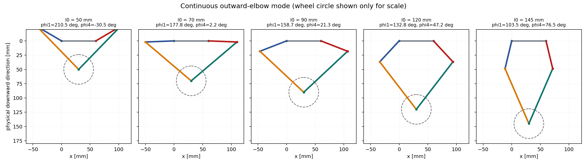

五个快照都属于同一向外肘装配模式，没有在缩腿和伸腿之间偷偷切换逆解。
虚线轮廓只按上游 26 mm 轮半径提供比例，图中向下为机器人腿的物理伸出
方向，并未绘制机身实体。

对机器人实际意味着：数学上可以从接近 46.10 mm 一直连续到 152.07 mm，
但这张杆系图不能证明无干涉。50 mm 附近短杆已经进入底板/机身邻近区域，
实际最短长度必须由 SolidWorks 碰撞扫描或实物测量决定；同理，长端还需
检查轮、电机、轴承和线束。

### 关节连续运动

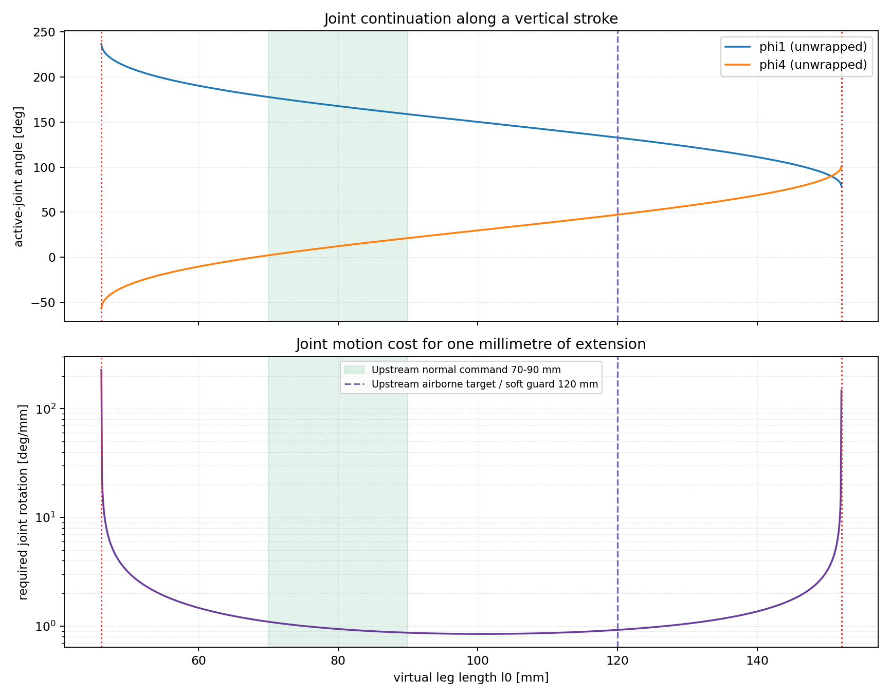

两个主动关节全程等幅反向运动。70 mm 时连续数学角约为
`phi1=177.77 deg, phi4=2.23 deg`，120 mm 时约为
`132.75 deg, 47.25 deg`；因此 70--120 mm 伸出时每个关节连续转动约
45.01 deg。这里是模型坐标，不包含实机编码器零偏。

对机器人实际意味着：中段每伸长 1 mm 只需约 `0.85--1.10 deg` 的关节
运动，轨迹平滑；靠近两个红色奇异端点，单位腿长所需的关节转角急剧增加，
关节即使高速转动也几乎不能继续伸缩。任何真实轨迹规划都应在端点之前保留
裕度，而不是把几何相切点设成目标。

### Jacobian 品质和奇异类型

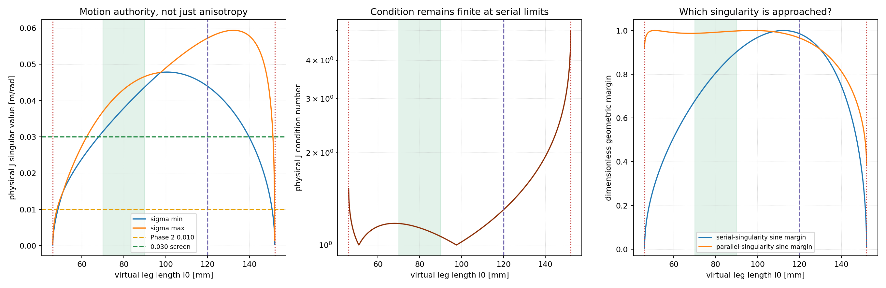

本图同时给出物理齐次 Jacobian 的两个奇异值、2-范数 condition 和两类几何
正弦裕度。最大 `sigma_min` 位于约 `l0=100.67 mm`，为
`0.04786 m/rad`。最小 condition 却位于约 50.96 mm，此时 condition 近乎
1，但 `sigma_min` 仅 `0.01481 m/rad`。

对机器人实际意味着：condition 只说明各方向是否均匀，不能说明绝对运动
能力。两个端点处奇异值一起趋零，所以 condition 仍有限；只监控 condition
会漏掉这种串联奇异。70--120 mm 内 `sigma_min>=约0.0315 m/rad`、
`condition<=约1.302`、平行奇异正弦裕度 `>=约0.966`，运动学品质良好且
均匀。阈值只是模型筛选，不是机械安全认证。

### 轴向力与固定腿角伸缩速度

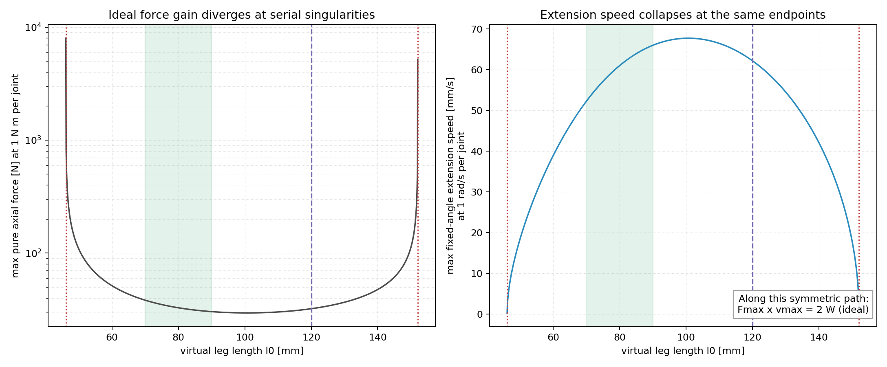

纯轴向推力仍按两个关节各 `1 N m`、`Tp=0` 归一化；伸缩速度按两个关节各
`1 rad/s` 且保持 `dphi0=0` 计算。在这条对称路径上，两者严格满足
`Fmax*vmax=2 W`：70 mm 约为 `38.28 N / 0.05225 m/s`，约 100 mm 为
`29.55 N / 0.06767 m/s`，120 mm 为 `32.19 N / 0.06213 m/s`。

对机器人实际意味着：靠近奇异端点出现的巨大理想推力，与伸缩速度趋零是
同一个传动比现象，不是额外性能。70--120 mm 则经过约 100.7 mm 的最高
速度裕度点，力/速度变化温和，适合作为蹬伸和缓冲的**运动学候选区**；这些
归一化值没有包含电机扭矩-转速耦合、功率、效率、热限制或冲击，不能证明
真实机器人能够跳跃或安全吸收落地能量。

### 现在真正知道了什么

- 原杆长在 70--120 mm 中心连续路径上没有明显结构性运动学缺陷，也不需要
  为了 Phase 2 的全局工作空间百分比立即改杆长。
- 70--90 mm 是代码证据充分的正常命令行程；70--120 mm 是控制器意图与
  运动学共同支持的优秀候选区，但仍缺 CAD/实机机械证据，不能称作已认证的
  实际行程。
- 数学理论行程 105.97 mm、控制意图候选行程 50 mm 都不能直接等同于
  15 cm 台阶能力。轮半径、机身轨迹、俯仰、接触切换和动力学同样决定结果。
- 这段中部路径为动态蹬伸和落地缓冲提供了良好几何基础，但没有质量、惯量、
  扭矩-转速-热包络、机械柔顺和接触模型时，不能提前得出动力学结论。

### 数据与复现

1201 点的连续路径数据和摘要位于：

- `artifacts/phase3/normal_vertical_stroke.csv.gz`
- `artifacts/phase3/summary.json`

重新生成第三阶段全部图和数据：

```bash
python3 scripts/analyze_stroke.py --resolution 1201
```

## 真实机械包络

完整工程判定见
[`docs/research/2026-08-23-real-mechanical-envelope.md`](docs/research/2026-08-23-real-mechanical-envelope.md)。
用户提供的 AP214 原总装已通过精确实体验收：80 个导入实体全部有效，从圆柱
面恢复的五个轴心反算出 `50/105/105/50/60 mm`，与 Phase 1--3 一致。

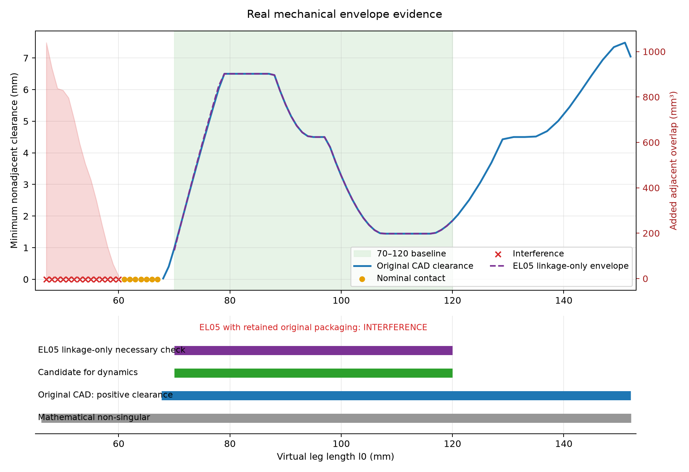

原结构 `70--120 mm` 的 51 个 1 mm 姿态全部无互穿和名义接触，最小间隙约
`0.985 mm`，因此它第一次同时具备“控制意图 + 良好运动学 + 原 CAD 无碰撞”
三层证据。对机器人实际意味着：这段行程可以继续作为执行器匹配和动力分析
输入，但 70 mm 附近不足 1 mm 的 STEP 名义间隙仍需公差和实物台架验证。

短端真实限制已被定位：`47--60.4 mm` 有主动杆/小腿互穿，`60.5--67.70 mm`
仍有 4010 电机/小腿零间隙接触，首个正间隙样本为 `67.71 mm`，但该点只有
约 25 nm 数值间隙，不能作为实用目标。长端到 152 mm 仍几何 CLEAR，实际先
遇到的是约 152.069 mm 的串联奇异。

EduLite 05 也不再是简单的“尺寸未知”：官方商品外形与腿系在 70--120 mm
满足必要的无碰撞条件，但保留原内部布局时会穿入 NanoPi/电池支架和支撑柱，
原 4010 支架及输出接口也不能复用。因此 EduLite 候选方向继续保留，原位直装
方案被否定；在新支架、主动杆接口、内部器件重排和线束 CAD 完成前，不能把
其最终机械行程写成已验证。

重新生成并校验姿态表和全部输入指纹：

重新生成并校验 1 mm CAD 姿态表和输入指纹：

```bash
python3 scripts/prepare_mechanical_envelope.py \
  --upstream-dir .worktrees/upstream-reference \
  --original-step /path/to/full_assembly_AP214.step \
  --original-parasolid /path/to/full_assembly.x_t \
  --edulite-step /path/to/official/el05.stp \
  --edulite-manual /path/to/official/EL05_manual.pdf
```

下一证据门不是继续扫描 Jacobian 或修改杆长，而是建立可制造的 EduLite 安装
CAD并重复同一实体扫描。通过后再进入执行器公开能力匹配、2--2.5 kg 整机和
150 mm 台阶动力学。

上游参考文件及来源说明位于 `reference/`，本项目按 GPL-3.0 发布。
