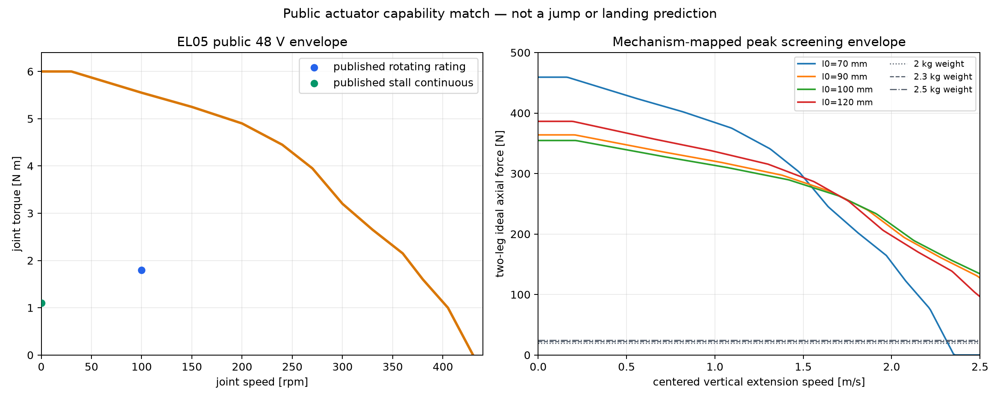

# EduLite EL05 公开能力与原五连杆匹配

## 这项匹配是什么意思

本阶段不研究 EL05 内部电机、减速器、FOC 或功率板，而是把厂家公开允许的输出
边界映射到已经验证的五连杆连续路径。它回答三个更直接的问题：

1. 静止支撑 2.0--2.5 kg 整机时，关节连续扭矩是否明显不足；
2. 腿以一定速度伸长时，厂家 48 V 扭矩--转速曲线还允许多少理想轴向力；
3. 哪些关键参数厂家没有公开，因而不能被代码自行补齐。

它仍然不是 150 mm 台阶动力学，也不是跳跃或落地预测。

## 厂家公开边界

证据固定为 `EL05使用说明书260713.pdf`，SHA-256 为
`a1c258af2b907ff81cb410302bbbc20b2e1f7c6fe1c0b78b02ac7584f27d1cdc`。

| 项目 | 厂家公开值 | 证据条件 |
|---|---:|---|
| 额定电压 | 48 VDC | 使用范围 15--60 VDC |
| 空载转速 | 430 rpm ±10% | 文字规格 |
| 旋转额定负载 | 1.8 N·m ±10% @ 100 rpm | 25°C、70×70 mm 铝散热板 |
| 堵转连续负载 | 1.1 N·m | 堵转过载表中的 rated 项 |
| 峰值负载 | 6 N·m | 峰值，不是连续值 |
| 单台质量 | 242±3 g | 四台名义共 0.968 kg |
| 通信 | CAN 2.0B、1 Mbps | 厂家私有扩展帧协议 |
| 控制接口 | 运控、Iq 电流、速度、PP、CSP | 运控指令范围 ±6 N·m、±50 rad/s |

旋转过载表给出 2/3/4/5/6 N·m 分别约 300/44/14/7/5 s；堵转过载表给出
1.8/3/4/5/6 N·m 分别约 175/13/6/2/1 s。这里只按表格离散档位保守使用，
不在相邻点之间自行创造厂家没有声明的持续时间。

厂家手册中的 48 V T--N 曲线是图片而非数据表。本仓库保存的是视觉数字化近似；
`430 rpm, 0 N·m` 端点由曲线与文字空载转速合并推得。因此它适合早期筛选，
不应被当作采购合同级保证曲线。

## 静态支撑结果

假设机身水平、两条竖直腿均分重量、没有俯仰扰动和额外加速度。对
`70--120 mm` 连续路径以 0.1 mm 分辨率扫描，最差点都在约 `100.7 mm`：

| 整机质量 | 最差每关节静态扭矩 | 相对 1.1 N·m 堵转连续值的名义裕度 |
|---:|---:|---:|
| 2.0 kg | 0.332 N·m | 3.31× |
| 2.3 kg | 0.382 N·m | 2.88× |
| 2.5 kg | 0.415 N·m | 2.65× |

这对“正常站立和平衡是否因静态扭矩明显不可行”给出强筛选证据：没有发现明显
不足。但它没有包含单腿瞬时承重、机身俯仰力矩、轮端加速度、摩擦、关节损耗和
支架散热条件，不能把 2.65× 直接称为实机安全系数。

## 力--速度筛选上界



左图橙线是厂家 48 V T--N 图片的近似数字化，蓝点和绿点分别是厂家明确给出的
旋转额定点和堵转连续点。右图把峰值曲线通过 Phase 3 的对称竖直路径映射为两腿
总轴向力。

例如 `l0=100 mm`、腿伸长 `0.5 m/s` 时，每个关节约为 `70.6 rpm`。按近似
峰值曲线可读到约 `5.74 N·m`，对应理想两腿轴向力约 `339 N`、理想总机械功率
约 `170 W`。这只说明电机公开包络与机构传动比在数量级上没有立即矛盾：

- 该力没有扣除机器人重量、损耗、结构变形和接触限制；
- 峰值曲线不是连续输出；
- 图使用 48 V，不能直接套到尚未确定的实际母线；
- 没有任务轨迹就不能积分出可靠冲量、起跳速度或离地高度；
- 厂家没有公开扭矩跟踪带宽和冲击工况精度。

因此右图的正确名称是“机构映射后的峰值筛选上界”，不是“机器人能产生的实测
蹬伸力”。

## 当前最值得注意的新事实

四台腿部 EL05 名义质量合计 `0.968 kg`，已经占 2.0 kg 整机目标的 `48.4%`，
占 2.5 kg 的 `38.7%`。这里还没有加入两台轮端电机、轮子、电池、底板、支架、
控制板和传感器。

所以目前公开能力匹配没有给出“EL05 扭矩明显不足”的证据，反而首先暴露了
总质量预算压力。2.0 kg 目标尤其激进；2.5 kg 是否能闭合仍要等完整质量清单，
现在不能猜。

## 工程判断

- **强筛选证据**：在理想两腿均载条件下，2.0--2.5 kg 的静态支撑不构成 EL05
  扭矩瓶颈。
- **合理推断**：公开峰值扭矩--转速数量级足以让 EL05 继续进入动态需求匹配，
  当前没有理由因腿部输出能力立即 REJECT。
- **明确风险**：四台执行器接近 1 kg，2.0 kg 整机质量目标可能无法闭合。
- **未知**：真实母线下的曲线、支架实际散热、控制带宽、重复动作占空比、落地
  吸能和 150 mm 越阶所需轨迹。

当前决策是 `EL05: KEEP FOR DYNAMIC REQUIREMENT MATCHING`，不是采购放行。
下一步应建立最小的整机质量清单，并定义一条不预设“纯竖直跳 150 mm”的候选
越阶轨迹，由轨迹反算关节扭矩、转速、功率和冲量。只有这样才能真正判断
`KEEP / REJECT`。

## 复现

```bash
python3 scripts/analyze_actuator_match.py
```

完整数值位于 `artifacts/actuator_match/summary.json`、
`force_speed_envelope.csv` 和 `static_support.csv`。
