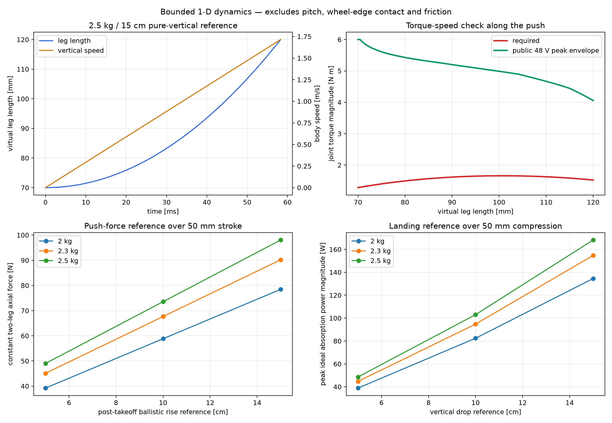

# 50 mm 蹬伸与落地缓冲的一维动力学筛选

## 先说明它在做什么

这不是让电脑假装已经做出一台真实机器人，也不是 MuJoCo 台阶仿真。它只把
已经验证过的 `70--120 mm` 连续腿长作为一段 50 mm 的“发力距离”，回答一个
更小的问题：如果 2.0--2.5 kg 整机沿竖直方向匀加速蹬伸，或者用同样行程匀减速
落地，关节所需的扭矩和转速是否已经明显超出 EL05 的公开能力数量级？

计算过程可以直观理解为四步：

1. 指定离地后还要上升的高度 `h`，由 `v=sqrt(2gh)` 得到离地速度；
2. 假定这段速度在 50 mm 行程内匀加速获得，由 `a=v²/(2s)` 得到加速度；
3. 用 `F=m(a+g)` 得到两条腿合计需要的竖直力；
4. 在每个腿长处用 Phase 3 已验证的五连杆 Jacobian，把腿力、腿速换算成四个
   主动关节各自的扭矩和转速，再与厂家公开的 48 V 峰值扭矩--转速曲线比较。

落地计算反过来进行：机器人以自由落体速度接触地面，并在 `120--70 mm` 的
50 mm 压缩行程内匀减速到零。它是理想吸能参考，不是实际落地控制器。

## 数量级结果

下表取最重的 `2.5 kg`。这里的 5/10/15 cm 是**离地后的竖直上升高度**；它们
不是腿长，也不等于采用轮缘接触、前进速度和机身俯仰后的真实台阶高度。

| 离地后上升 | 离地速度 | 蹬伸时间 | 两腿总力 | 理想做功 | 峰值总机械功率 | 峰值关节转速 | 峰值每关节扭矩 | 峰值包络利用率 |
|---:|---:|---:|---:|---:|---:|---:|---:|---:|
| 5 cm | 0.990 m/s | 101.0 ms | 49.0 N | 2.45 J | 48.6 W | 152 rpm | 0.830 N·m | 15.2% |
| 10 cm | 1.400 m/s | 71.4 ms | 73.5 N | 3.68 J | 103.0 W | 215 rpm | 1.244 N·m | 24.2% |
| 15 cm | 1.715 m/s | 58.3 ms | 98.1 N | 4.90 J | 168.2 W | 264 rpm | 1.659 N·m | 37.6% |



在扫描的 3 个质量、3 个高度及蹬伸/落地共 18 个参考工况中，扭矩--转速幅值
都落在当前数字化的厂家峰值包络内；最严苛点是 `2.5 kg / 15 cm`，利用率约
`37.6%`。这说明没有发现“仅从理想扭矩和转速数量级看就必然做不到”的矛盾。

相同高度和行程下，理想落地缓冲与蹬伸具有相同的力、关节扭矩和转速幅值，
但功率方向相反。`2.5 kg / 15 cm` 的参考落地需要在约 58 ms 内吸收约
`4.90 J`，瞬时机械吸收功率最高约 `168 W`。

## 证据等级与批判性复核

- **已证明（在所写数学模型内）**：上述速度、恒加速度、力、能量以及经过
  Phase 3 Jacobian 的关节映射数值可复现；质量和目标高度均为显式参数。
- **强筛选证据**：理想 50 mm 纯竖直动作没有暴露 EL05 峰值扭矩--转速的
  数量级冲突，原杆长也没有在这一步显出必须修改的理由。
- **合理推断**：EL05 候选方向值得继续，150 mm 任务并非已经被一阶数量级
  计算否定。
- **假设**：两腿始终均分负载，整个机器人是一个竖直点质量，完整 50 mm 行程
  都用于匀加速或匀减速，腿保持中心竖直，且采用 48 V 厂家近似峰值曲线。
- **未知**：轮子和杆件转动惯量、支架柔性和损耗、前向速度、摩擦、机身俯仰、
  轮子碰台阶边缘后的接触切换、真实电压下的扭矩跟踪、落地冲击控制以及重复动作。

尤其要避免两种误读：

1. “纯竖直再升 15 cm 的参考点落在峰值包络内”不等于“实机一定能上
   15 cm 台阶”。前者没有模拟轮子与台阶；
2. 落地时扭矩--转速**幅值**匹配，不证明商品执行器和整机供电系统已经具备
   所需的实际吸能与冲击控制能力。

这个模型还把整机质量全部当作随腿竖直加速的质量，忽略前进和轮缘支撑可能带来
的帮助；另一方面，它也忽略了惯量、损耗和左右负载不均。因而它不是严格的
乐观上界或保守下界，而是一个用于排除明显数量级错误的基准。

## 当前工程判断

对 `KEEP / REJECT` 的直接结论是：

- 原 `50/105/105/50/60 mm` 五连杆：`KEEP`；没有新证据要求改杆长。
- EL05 输出能力方向：`KEEP FOR NEXT VALIDATION`；尚未发现明显峰值能力矛盾，
  但不是采购或实机动作放行。
- 150 mm 台阶任务：`POSSIBLY FEASIBLE, EVIDENCE INSUFFICIENT`。

下一步不应继续把一维模型做得更复杂。现在真正缺少的是台阶几何和接触：轮子
何时碰到边缘、接触后机身如何俯仰、前进速度贡献多少、是否打滑。MuJoCo 的
价值正在这里——它是带刚体、关节、质量、惯量、碰撞和摩擦的物理仿真器；外观
是否逼真取决于是否使用真实 CAD 网格，而动力结果是否可信主要取决于碰撞几何、
质量惯量、关节和接触参数是否正确。漂亮模型本身不等于可信仿真。

进入 MuJoCo 前，只需先把第一条候选动作定义清楚，并准备整机各主要刚体的质量
和惯量。实物装好后的主动关节机械零位、左右方向和实际腿长测量，会作为标定值
写入模型；组装角度当然会影响实机，但不需要靠装配者肉眼达到数学上的绝对角度。
正常做法是组装后回到已知基准姿态，记录编码器零偏并验证轮轴位置。

## 复现

```bash
python3 scripts/analyze_simple_dynamics.py
```

逐采样轨迹、汇总数字和图片分别位于
`artifacts/simple_dynamics/trajectories.csv`、`summary.json` 和
`simplified_dynamics.png`。
